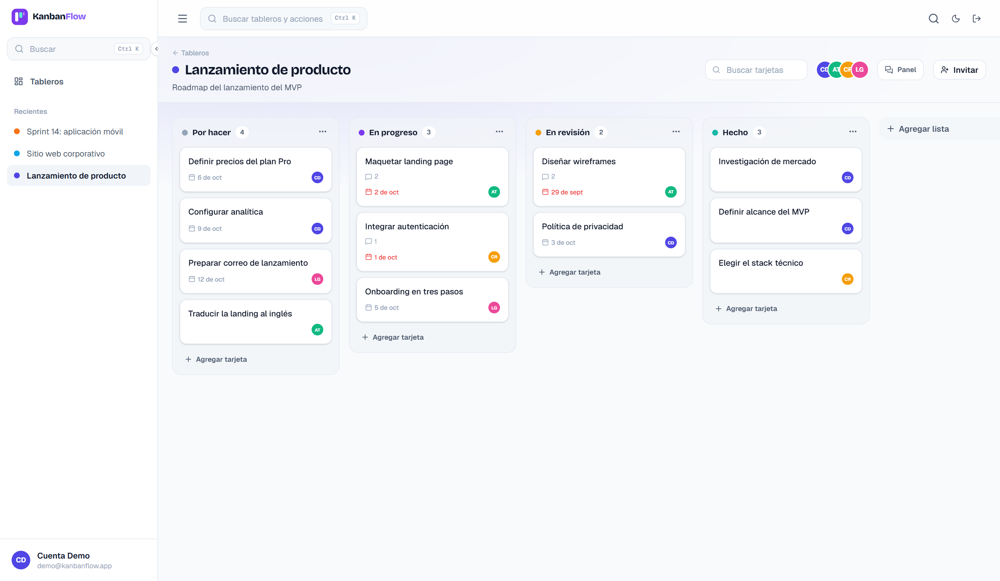
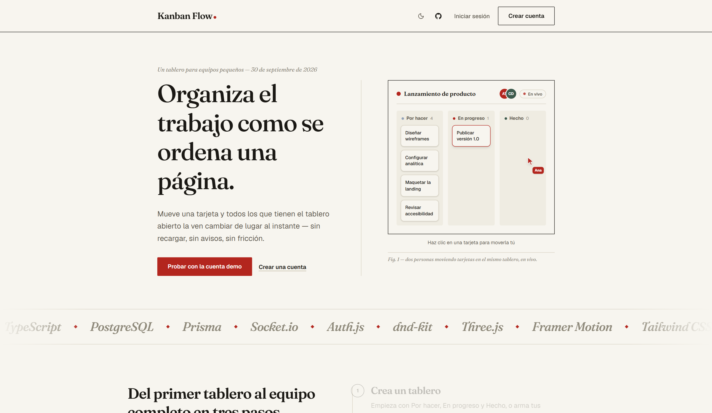
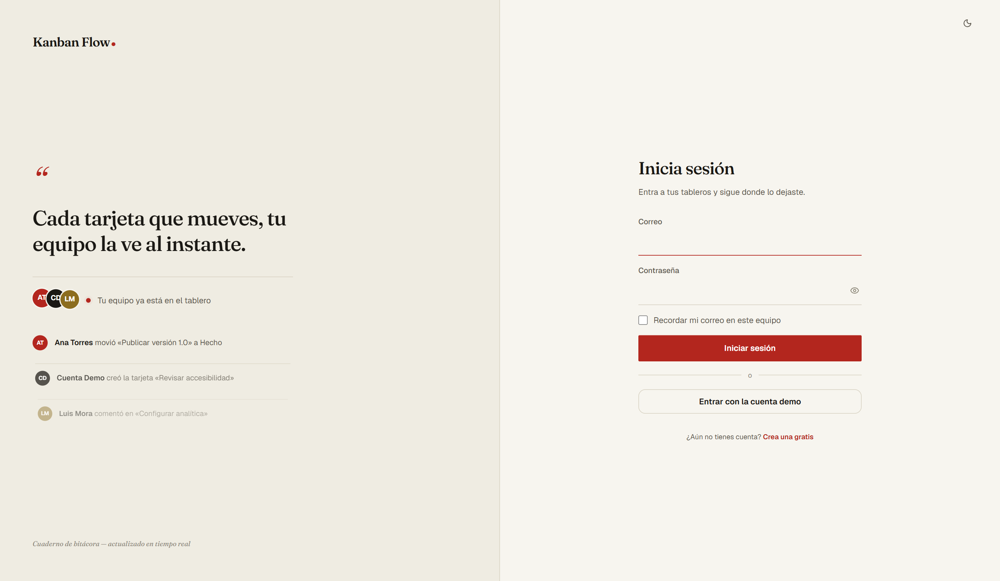
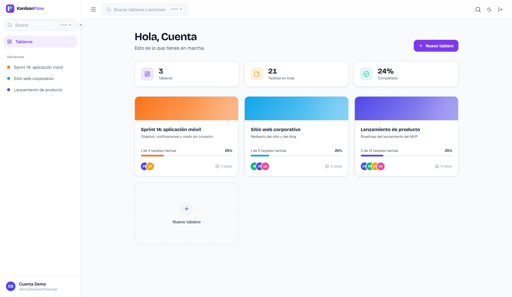
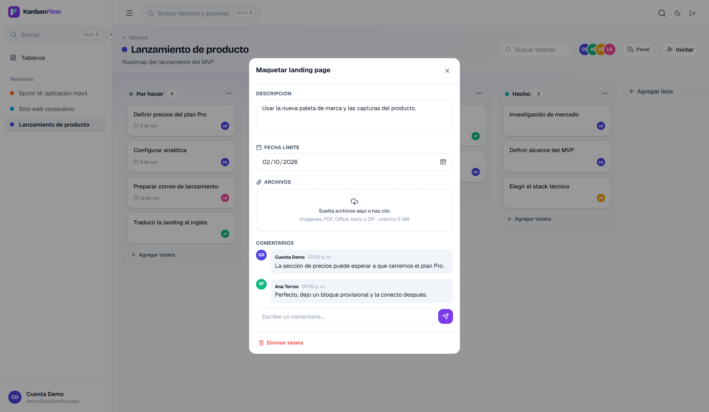
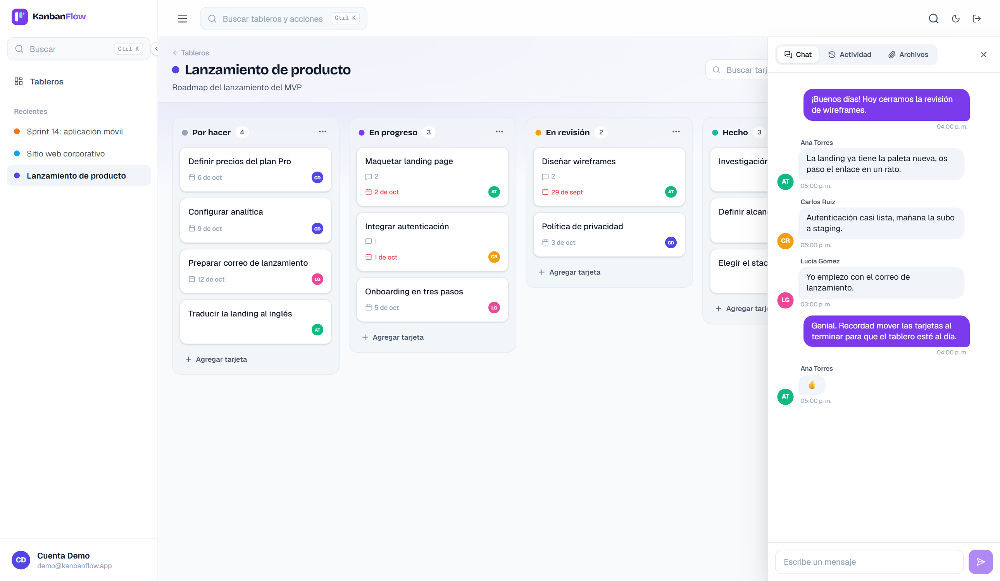
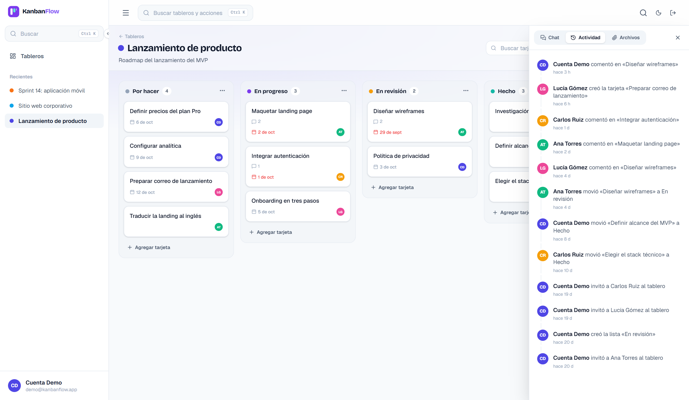
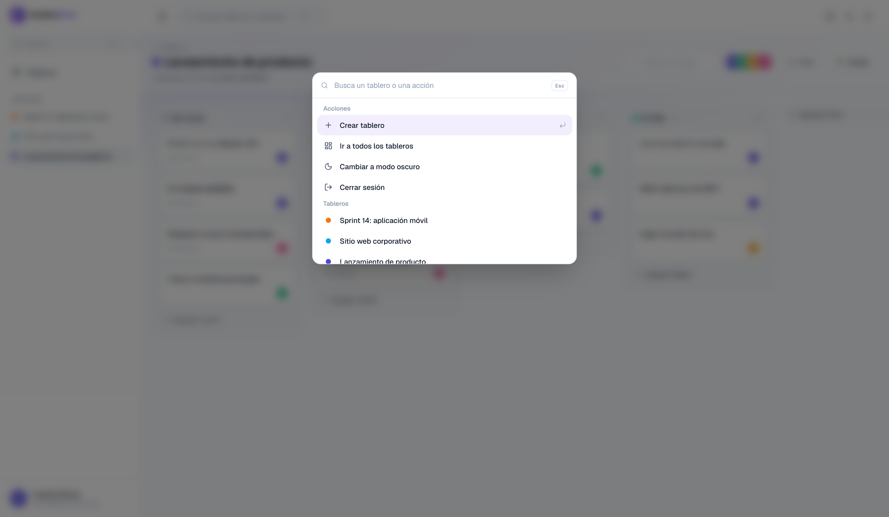
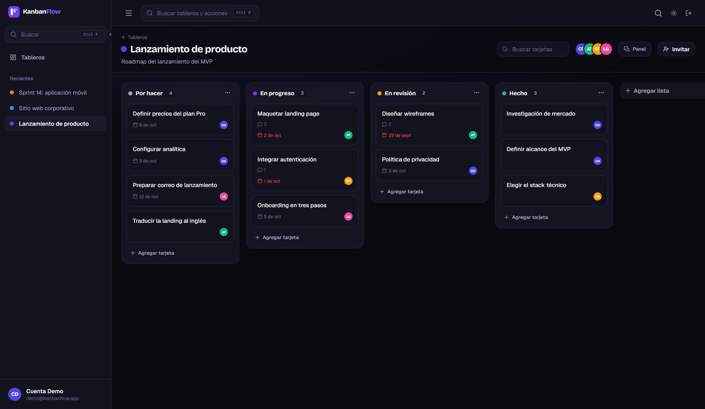
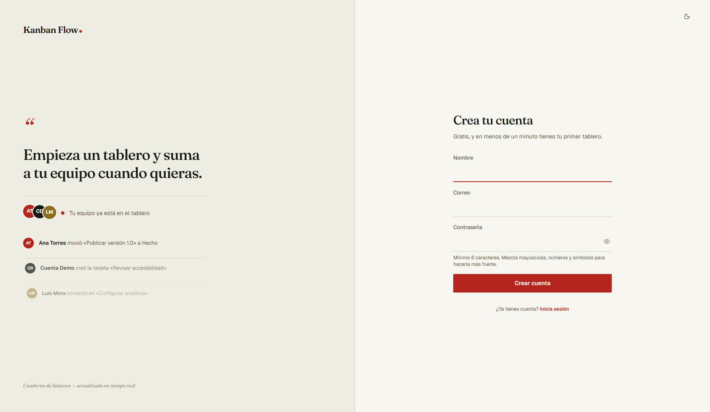

# KanbanFlow

Tableros Kanban colaborativos con actualizaciones en tiempo real: arrastra y suelta tarjetas entre listas y todos los que tengan el tablero abierto lo ven al instante, sin recargar la página.

Cuenta de prueba: `demo@kanbanflow.app` / `demo1234` (o el botón "Probar con la cuenta demo" en la página principal). La demo trae 3 tableros con tarjetas, fechas límite, comentarios, chat e historial; las otras cuentas (`ana@`, `carlos@` y `lucia@kanbanflow.app`) usan la misma contraseña, para probar el tiempo real con dos navegadores.



## Documentación

| Documento | Contenido |
|---|---|
| [**Guía del código**](docs/GUIA-DEL-CODIGO.md) | Cómo está construido: servidor con Socket.io, autenticación, control de acceso, drag & drop en tiempo real y subida segura de archivos, con fragmentos del código explicados |
| [**Base de datos (PostgreSQL)**](docs/BASE-DE-DATOS.md) | Modelo de datos, diagramas entidad-relación, decisiones de diseño y 10 consultas con su resultado real |

## Por qué existe este proyecto

Es un proyecto de portafolio construido para demostrar un stack distinto al de mis otros proyectos: TypeScript de punta a punta, una base de datos relacional con un ORM (en vez de SQL crudo), colaboración en tiempo real vía WebSockets, y un flujo de autenticación con Auth.js.

## Características

- **Arrastrar y soltar** entre listas y dentro de una misma lista, con [dnd-kit](https://dndkit.com/).
- **Tiempo real**: crear, editar, mover o eliminar tarjetas/listas se propaga al instante a todos los clientes conectados al tablero vía Socket.io.
- **Presencia en vivo**: ves los avatares de quién más tiene el tablero abierto ahora mismo.
- **Colaboración**: invita a alguien por correo (debe tener cuenta) para que edite el tablero contigo.
- **Comentarios** por tarjeta, fecha límite, y descripción.
- **Cuentas reales**: registro con contraseña cifrada (bcrypt) o la cuenta demo para probar sin registrarse.
- **Modo oscuro** con persistencia en `localStorage` y sin parpadeo al cargar.

## Capturas

| | |
|---|---|
|  |  |
| **Página de inicio** con un tablero de demostración en vivo | **Inicio de sesión** con acceso directo a la cuenta demo |
|  |  |
| **Mis tableros** con progreso y miembros | **Detalle de tarjeta**: descripción, fecha límite, archivos y comentarios |
|  |  |
| **Chat del tablero** en tiempo real | **Historial de actividad** de todo el equipo |
|  |  |
| **Paleta de comandos** con `Ctrl + K` | **Modo oscuro** |
|  | |
| **Registro** con validación en línea | |

## Base de datos

PostgreSQL con Prisma: 9 tablas, claves foráneas con borrado en cascada desde el tablero, índice único para que nadie esté dos veces en un tablero e índices compuestos para el chat y el historial. Detalle completo en [docs/BASE-DE-DATOS.md](docs/BASE-DE-DATOS.md).

| | |
|---|---|
|  |  |
| **Modelo entidad-relación** de tableros, listas y tarjetas | **Progreso de cada tablero** calculado en SQL |
|  |  |
| PostgreSQL rechaza una **invitación duplicada** | **Claves foráneas** con `CASCADE` y `RESTRICT` |

## Stack técnico

| Capa | Tecnología |
|---|---|
| Framework | Next.js 16 (App Router) + TypeScript |
| Estilos | Tailwind CSS v4 |
| Base de datos | PostgreSQL + Prisma ORM |
| Autenticación | Auth.js (NextAuth v5), credenciales + bcrypt |
| Tiempo real | Socket.io sobre un servidor Node personalizado |
| Drag & drop | @dnd-kit |
| Animaciones | Framer Motion |
| Tests | Vitest + Testing Library |

### Por qué un servidor personalizado

Socket.io necesita un proceso Node persistente para mantener las conexiones WebSocket abiertas, algo que no encaja con funciones serverless de vida corta. Por eso `server.ts` envuelve el manejador de peticiones de Next.js y adjunta Socket.io al mismo servidor HTTP — ambos corren en el mismo proceso, así que las rutas API pueden emitir eventos por WebSocket importando el mismo singleton (`src/lib/socket.ts`) que usa el servidor. Esto también significa que el despliegue debe ser a un host que corra un proceso Node persistente (Railway, Render, Fly.io), no a funciones serverless puras como Vercel.

## Cómo funciona el drag & drop en tiempo real

1. El cliente que arrastra una tarjeta actualiza su estado local al instante (optimista).
2. Al soltar, hace `POST /api/boards/:id/reorder` con el orden final de las listas afectadas (máximo 2: origen y destino).
3. El servidor valida que esas listas/tarjetas pertenezcan al tablero, persiste el nuevo orden en una transacción de Prisma, y emite `board:reordered` a todos los sockets en la sala `board:{id}` — incluido quien hizo el cambio, para que el estado converja igual en todos los clientes.

## Empezar en local

### Requisitos

- Node 20+
- Una base de datos PostgreSQL (local o en la nube — [Neon](https://neon.tech) y [Railway](https://railway.app) tienen niveles gratuitos)

### Pasos

```bash
npm install
cp .env.example .env
# edita .env con tu DATABASE_URL real y un AUTH_SECRET (genera uno con: npx auth secret)

npm run db:push    # crea las tablas en tu base de datos
npm run db:seed    # crea la cuenta y el tablero de demostración

npm run dev         # http://localhost:3000
```

### Scripts disponibles

| Script | Qué hace |
|---|---|
| `npm run dev` | Servidor de desarrollo (Next.js + Socket.io) con recarga automática |
| `npm run build` | Build de producción de Next.js |
| `npm start` | Sirve el build de producción a través del servidor personalizado |
| `npm test` | Corre la suite de Vitest |
| `npm run lint` | ESLint |
| `npm run db:studio` | Abre Prisma Studio para inspeccionar la base de datos |

## Estructura del proyecto

```
src/
  app/                 # Rutas (App Router): landing, login, registro, tableros
    api/               # Rutas de API: auth, boards, lists, cards, comments
    boards/[boardId]/  # Vista de un tablero
  components/
    board/             # Componentes específicos del tablero (columnas, tarjetas, dnd)
  context/             # SocketContext: una única conexión de Socket.io compartida
  lib/                 # prisma, auth, validación (zod), acceso a tableros, socket
  types/               # Tipos compartidos entre API y UI
server.ts              # Servidor HTTP personalizado: Next.js + Socket.io en el mismo proceso
prisma/schema.prisma    # Modelo de datos
```

## Desplegar

1. Aprovisiona una base de datos Postgres (Neon, Railway, Supabase...).
2. Despliega a un host con proceso Node persistente — **Railway** o **Render** son las opciones más simples porque corren `npm start` directamente (a diferencia de Vercel, pensado para funciones serverless, que no sostiene la conexión WebSocket de Socket.io).
3. Variables de entorno en el host: `DATABASE_URL`, `AUTH_SECRET`, `NEXTAUTH_URL` (la URL pública del deploy).
4. Corre `npm run db:push` (o `db:migrate` si usas migraciones) y `npm run db:seed` una vez contra la base de datos de producción.

## Licencia

MIT
