# Base de datos (PostgreSQL + Prisma)

KanbanFlow guarda todo en **PostgreSQL**. El esquema se define en [`prisma/schema.prisma`](../prisma/schema.prisma) y Prisma crea las tablas, las claves foráneas y los índices a partir de él (`npm run db:push`).

Las imágenes de este documento se generaron ejecutando las consultas **sobre la base real de la demo** (`npm run db:seed`): los resultados no están escritos a mano. Los diagramas se construyeron leyendo las claves foráneas que Prisma creó en PostgreSQL.

## Contenido

- [Modelo de datos](#modelo-de-datos)
- [Diagramas entidad-relación](#diagramas-entidad-relación)
- [Decisiones de diseño](#decisiones-de-diseño)
- [Consultas de ejemplo](#consultas-de-ejemplo)
- [Cómo reproducir las consultas](#cómo-reproducir-las-consultas)

## Modelo de datos

9 tablas. Prisma las nombra igual que los modelos, así que en SQL se escriben entre comillas: `"Board"`, `"Card"`, `"boardId"`.

| Tabla | Qué guarda |
|---|---|
| `User` | Cuentas: nombre, correo único, contraseña cifrada con bcrypt y color del avatar |
| `Board` | Tableros, con su propietario (`ownerId`) |
| `BoardMember` | Personas invitadas a un tablero y su rol (`OWNER` o `MEMBER`) |
| `List` | Columnas del tablero, con su orden (`position`) |
| `Card` | Tarjetas: título, descripción, fecha límite, orden dentro de la lista y quién la creó |
| `Comment` | Comentarios de cada tarjeta |
| `Attachment` | Archivos adjuntos (los metadatos; el archivo se guarda en disco) |
| `Message` | Mensajes del chat de cada tablero |
| `Activity` | Historial: "Ana movió «Diseñar wireframes» a En revisión" |

## Diagramas entidad-relación

El código Mermaid de cada diagrama está en [`docs/database/`](database/) (archivos `.mmd`).

### Tableros, listas y tarjetas
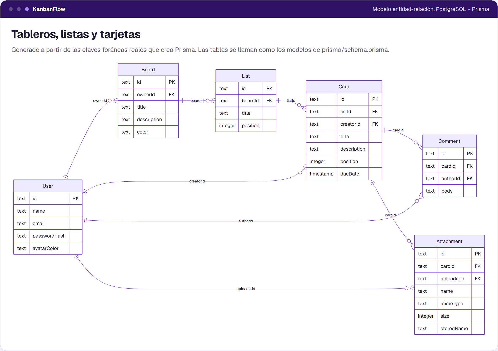

### Colaboración: miembros, chat e historial
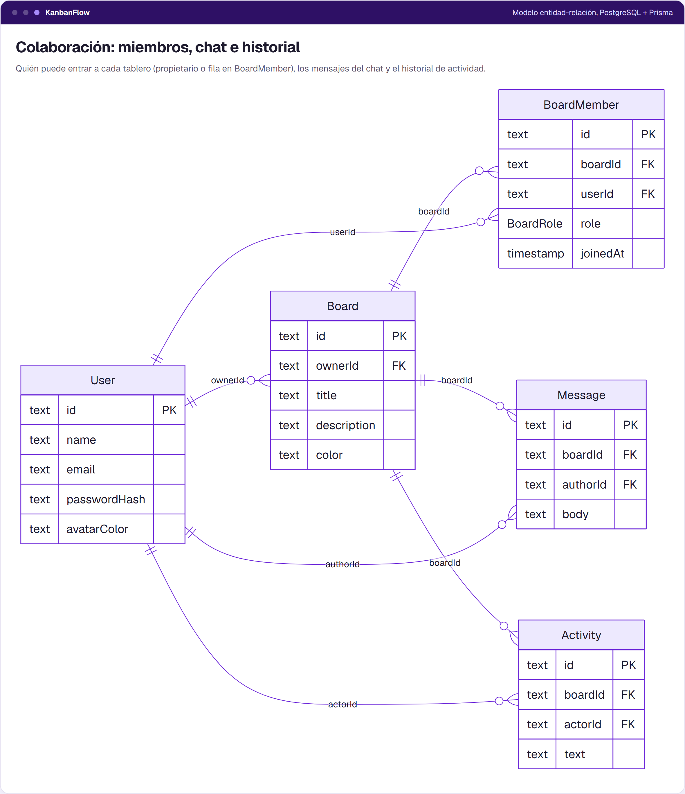

## Decisiones de diseño

| Decisión | Por qué |
|---|---|
| **Identificadores `cuid()`** en lugar de números consecutivos | Aparecen en las URLs (`/boards/clx...`): no se pueden adivinar ni recorrer probando `/boards/1`, `/boards/2`... |
| **Orden con una columna `position`** | Arrastrar y soltar solo reescribe las posiciones de las listas afectadas (como mucho dos), dentro de una transacción. |
| **`ON DELETE CASCADE` desde el tablero** | Borrar un tablero borra sus listas, tarjetas, comentarios, adjuntos, mensajes e historial en una sola operación de la base de datos. |
| **`ON DELETE RESTRICT` hacia el autor** | No se puede borrar un usuario que escribió comentarios, mensajes o tarjetas: el historial nunca queda con autores huérfanos. |
| **Índice único `(boardId, userId)`** en `BoardMember` | Una persona no puede estar dos veces en el mismo tablero, aunque lleguen dos invitaciones a la vez. |
| **Índices compuestos `(boardId, createdAt)`** en `Message` y `Activity` | El chat y el historial siempre se leen por tablero y en orden de fecha. |
| **El propietario no es una fila de `BoardMember`** | `ownerId` ya da acceso; los miembros son solo los invitados. La regla vive en `src/lib/boardAccess.ts`. |
| **Correo único** (`User_email_key`) | Es el identificador para iniciar sesión e invitar a alguien a un tablero. |

## Consultas de ejemplo

Los archivos SQL están en [`docs/database/queries/`](database/queries/) y se pueden ejecutar tal cual.

### 1. Resumen de cada tablero
[`01-resumen-de-tableros.sql`](database/queries/01-resumen-de-tableros.sql): el mismo cálculo de progreso que la pantalla de tableros, con `DISTINCT ON` y `FILTER`.

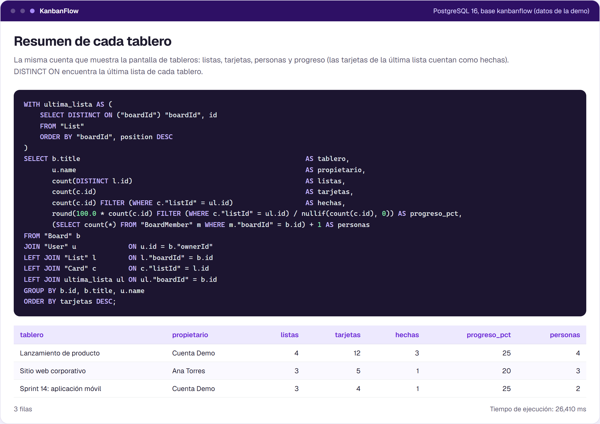

### 2. El tablero tal como se dibuja
[`02-tablero-ordenado.sql`](database/queries/02-tablero-ordenado.sql): `string_agg ... ORDER BY position`.

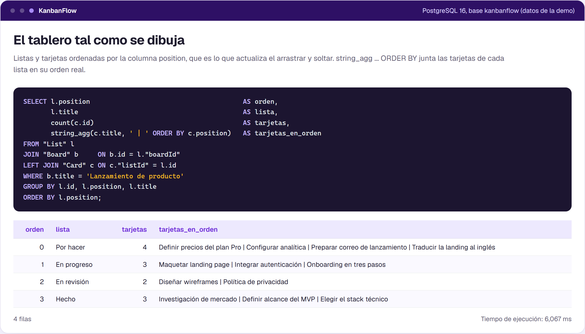

### 3. Vencimientos
[`03-vencimientos.sql`](database/queries/03-vencimientos.sql): vencidas, esta semana y sin fecha en una sola pasada.

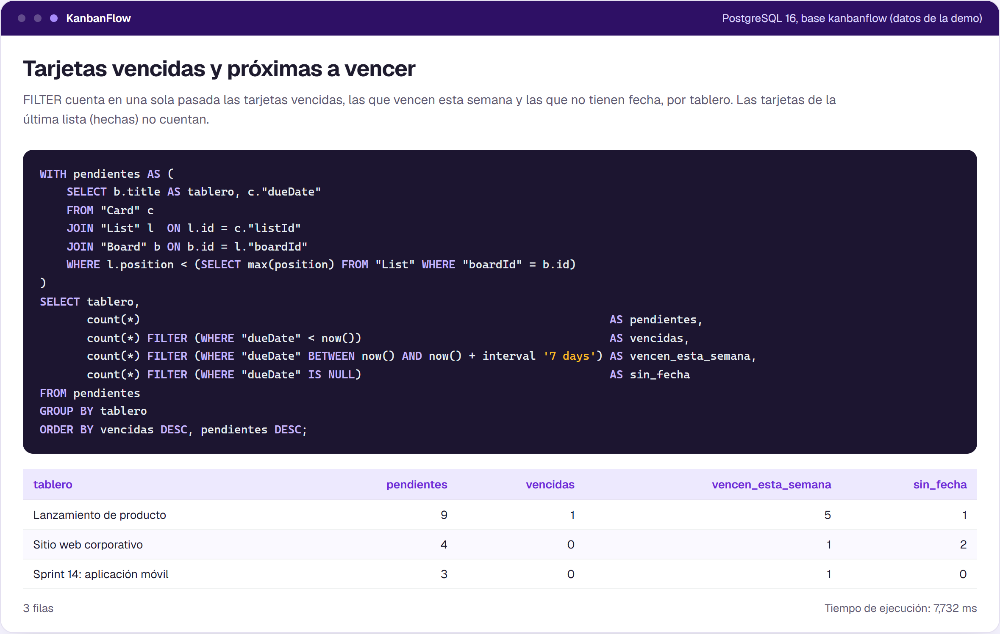

### 4. Participación de cada persona
[`04-participacion-por-persona.sql`](database/queries/04-participacion-por-persona.sql): `UNION ALL` de tres tablas.

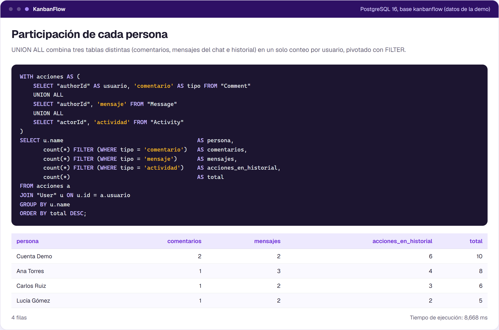

### 5. Acceso a los tableros
[`05-acceso-a-tableros.sql`](database/queries/05-acceso-a-tableros.sql): la regla de `boardAccess.ts` escrita en SQL.

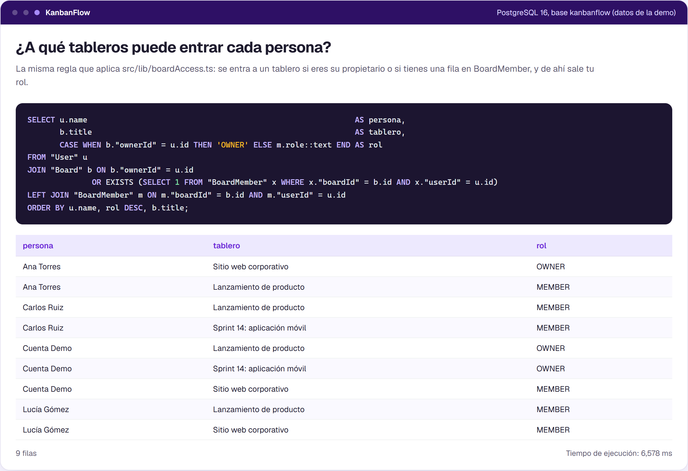

### 6. Historial reciente
[`06-historial-reciente.sql`](database/queries/06-historial-reciente.sql): lo que muestra la pestaña Actividad.

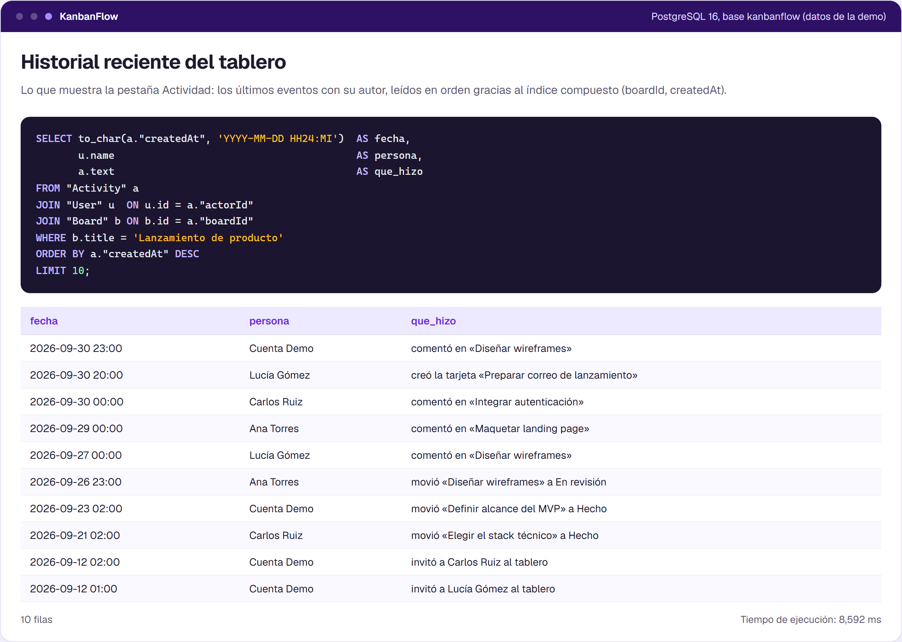

### 7. Claves foráneas
[`07-claves-foraneas.sql`](database/queries/07-claves-foraneas.sql): `CASCADE` y `RESTRICT` leídos del catálogo.

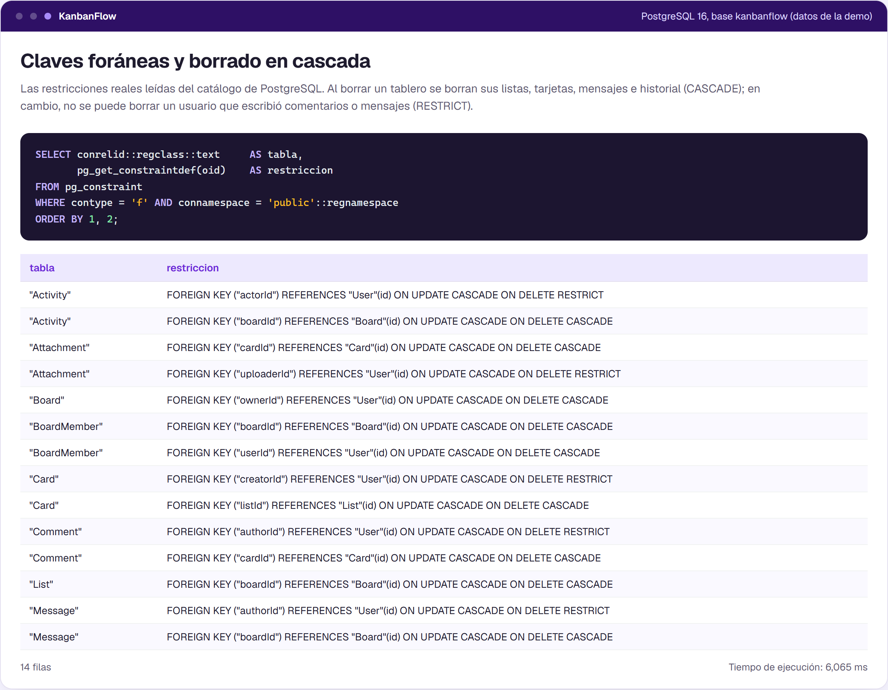

### 8. Restricción única
[`08-restriccion-unica.sql`](database/queries/08-restriccion-unica.sql): PostgreSQL rechaza una invitación duplicada.

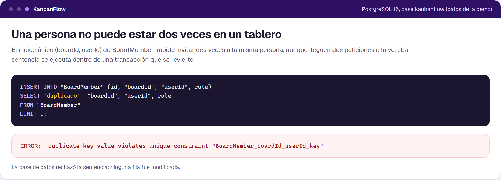

### 9. Plan de ejecución
[`09-plan-de-ejecucion.sql`](database/queries/09-plan-de-ejecucion.sql): el índice `(boardId, createdAt)` del chat.

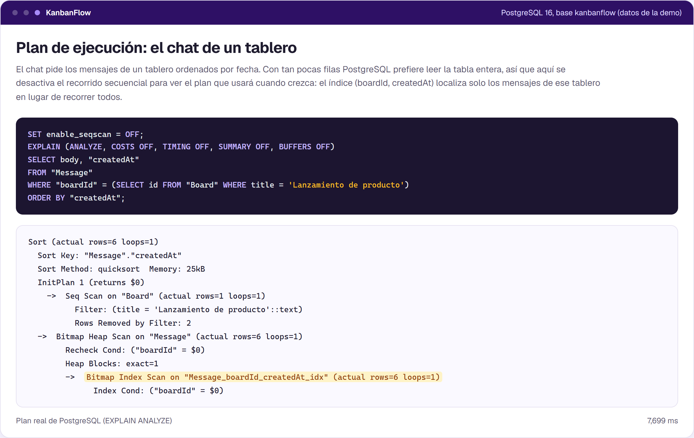

### 10. Tablas
[`10-tablas.sql`](database/queries/10-tablas.sql): filas y tamaño de cada tabla.

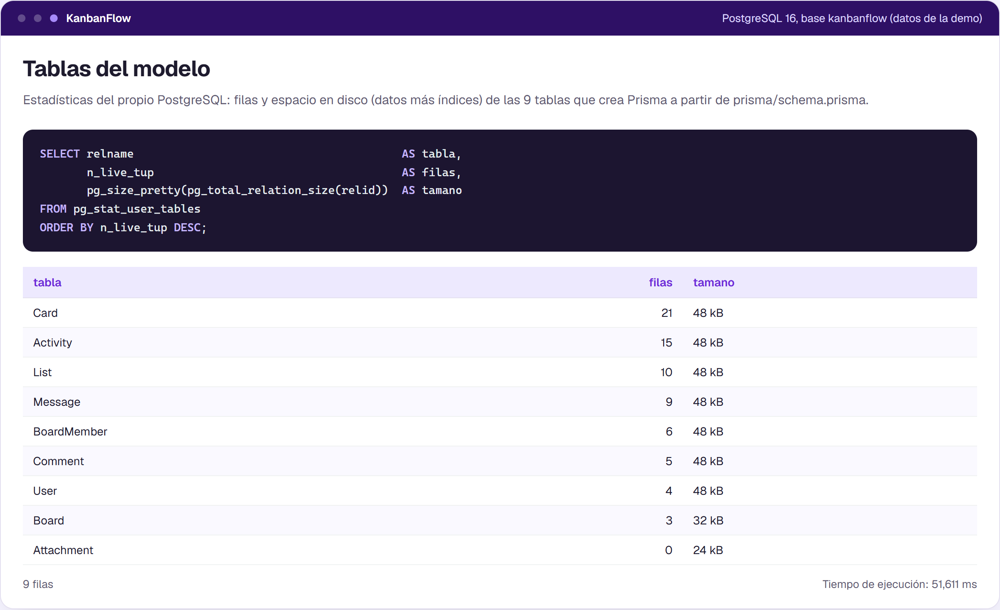

## Cómo reproducir las consultas

Con la base configurada en `DATABASE_URL` y los datos de la demo cargados (`npm run db:push` y `npm run db:seed`):

```bash
psql "$DATABASE_URL" -f docs/database/queries/01-resumen-de-tableros.sql
```

O de forma visual con **Prisma Studio** (`npm run db:studio`), DBeaver o pgAdmin.
